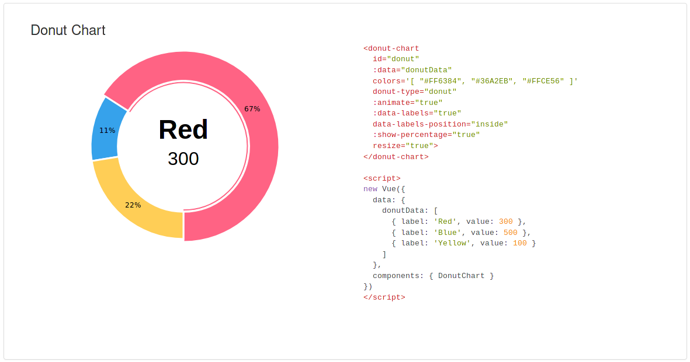

# vue-morris

> Vue.js components wrapping Morris.js 06 lib
>
> This component wraps the charts library <a href="https://pierresh.github.io/morris.js/">morris.js06</a>.
> See https://pierresh.github.io/morris.js/ for documentation
>
> This is a fork of <a href="https://github.com/bbonnin/vue-morris">vue-morris</a> by bbonnin but implementing pierresh's morris 06.

> Depends on Vue.js v2.1.0+

## Install

Sorry, no npm available. However, you can use github link.

## Examples

- Import the component

```javascript
// Do not forget to import raphael
import Raphael from 'raphael/raphael'
global.Raphael = Raphael

import Vue from 'vue'
import { DonutChart } from 'vue-morris'

new Vue({
  el: '#app',

  data: {
    donutData: [
      { label: 'Red', value: 300 },
      { label: 'Blue', value: 50 },
      { label: 'Yellow', value: 100 }
    ],

    components: {
    DonutChart, BarChart, LineChart, AreaChart
  }
})
```

- Use the component in html

```html
<donut-chart id="donut" :data="donutData" colors='[ "#FF6384", "#36A2EB", "#FFCE56" ]' resize="true"> </donut-chart>
```

- Bar chart
  

- Line chart
  

- Area chart
  

- Donut chart
  

## Build Setup

```bash
# install dependencies
npm install

# serve with hot reload at localhost:8080
npm run dev

# build for production with minification
npm run build
```
